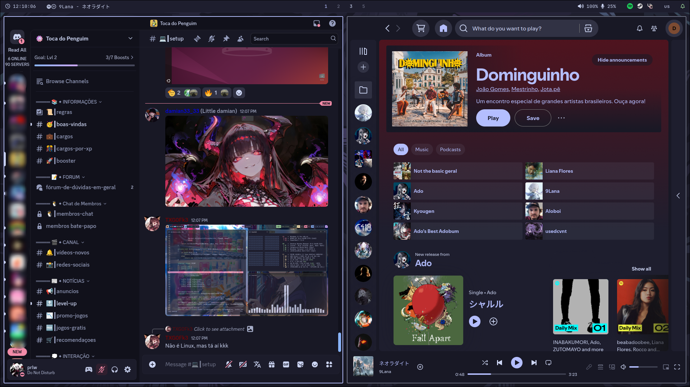

# 🎨 Dotfiles

> ℹ️ **The following instructions assume that the user is using an Arch Linux system.**

---

# 🛠️ Instructions

## Required Dependencies (for full functionality)

- [Apple Fonts](https://developer.apple.com/fonts/)
- [Chafa](https://github.com/hpjansson/chafa)
- [Cliphist](https://github.com/sentriz/cliphist)
- [Discord](https://github.com/discord)
- [Font Awesome](https://github.com/FortAwesome/Font-Awesome)
- [Foot](https://codeberg.org/dnkl/foot)
- [GTK Catppuccin Theme](https://github.com/catppuccin/gtk)
- [GTK Gruvbox Theme](https://github.com/Fausto-Korpsvart/Gruvbox-GTK-Theme)
- [GTK Whitesur Theme](https://github.com/vinceliuice/WhiteSur-gtk-theme)
- [GTK Whitesur Icon Theme](https://github.com/vinceliuice/WhiteSur-icon-theme)
- [Hyprland](https://github.com/hyprwm/Hyprland)
- [Hyprlock](https://github.com/hyprwm/hyprlock)
- [Hyprpicker](https://github.com/hyprwm/hyprpicker)
- [Hyprshot](https://github.com/Gustash/Hyprshot)
- [JetBrains Mono](https://github.com/JetBrains/JetBrainsMono)
- [Kitty](https://github.com/kovidgoyal/kitty)
- [Mission Center](https://github.com/Slimbook-Team/mission-center)
- [Neofetch](https://github.com/dylanaraps/neofetch)
- [Nerd Fonts](https://github.com/ryanoasis/nerd-fonts)
- [NWG Look](https://github.com/nwg-piotr/nwg-look)
- [Oh My Zsh](https://github.com/ohmyzsh/ohmyzsh)
- [Rofi](https://github.com/davatorium/rofi)
- [Rofi-Emoji](https://github.com/Mange/rofi-emoji)
- [Rofi Power Menu](https://github.com/jluttine/rofi-power-menu)
- [Spicetify](https://github.com/spicetify/cli)
- [Spicetify Marketplace](https://github.com/spicetify/marketplace)
- [SwayNC](https://github.com/ErikReider/SwayNotificationCenter)
- [Thunar](https://docs.xfce.org/xfce/thunar/start)
- [Vencord Hook](https://aur.archlinux.org/packages/vencord-hook)
- [Vesktop](https://github.com/Vencord/Vesktop)
- [Waybar](https://github.com/Alexays/Waybar)
- [zsh](https://github.com/zsh-users/zsh)

### Install all packages from both repositories:

#### Official Repositories (using `pacman`):

```bash
sudo pacman -S --needed chafa cliphist discord ttf-font-awesome otf-font-awesome foot hyprland hyprlock hyprpicker ttf-jetbrains-mono kitty mission-center neofetch nerd-fonts nwg-look rofi rofi-emoji swaync thunar waybar zsh
```

#### AUR (using `yay` or `paru`):

> ℹ️ **You can use either yay or paru depending on which AUR helper you have installed.**

```bash
yay -S --needed apple-fonts catppuccin-gtk-theme-mocha gruvbox-gtk-theme-git hyprshot oh-my-zsh-git rofi-power-menu spicetify-cli spicetify-marketplace-bin vencord-hook vesktop-bin whitesur-gtk-theme whitesur-icon-theme
```

_or_

```bash
paru -S --needed apple-fonts catppuccin-gtk-theme-mocha gruvbox-gtk-theme-git hyprshot oh-my-zsh-git rofi-power-menu spicetify-cli spicetify-marketplace-bin vencord-hook vesktop-bin whitesur-gtk-theme whitesur-icon-theme
```

---

## After Installing Dependencies

> 📌 **Copy everything inside this repository to your `home` folder or `git clone` it:**

1. Download this repo.

2. Copy the files to your `home` folder:

```bash
cp path-to-files ~/
```

_or_

1. Git clone it:

```bash
cd ~
git clone https://github.com/DimitryGonzales/dotfiles.git
```

> 📌 **Apply/Change the themes with `theme.sh` script.**

### Discord with Vencord

If **Discord** is not pacthed, reinstall it. `vencord-hook` will patch it automatically:

```bash
sudo pacman -S discord
```

### VSCode

Install the corresponding colors extension for your theme:

- [Catppuccin](https://marketplace.visualstudio.com/items?itemName=Catppuccin.catppuccin-vsc)
- [Gruvbox](https://marketplace.visualstudio.com/items?itemName=jdinhlife.gruvbox)
- [MacOS Modern Theme](https://marketplace.visualstudio.com/items?itemName=davidbwaters.macos-modern-theme)

### Waybar

Inside `~/.config/waybar/config.jsonc`, locate both Waybar configurations (one for each monitor) and change the **output** field in each section to match your respective monitors. If you only have one monitor, update the **output** value in the section corresponding to that monitor. This determines which monitor each Waybar appears on. If you are on hyprland, check monitors names with:

```bash
hyprctl monitors
```

---

# 🖼️ Examples

> ⚠️ *These images do not showcase all features/configurations.*

## Catppuccin Mocha Lavender

<table>
    <tr>
        <td></td>
        <td></td>
    </tr>
    <tr>
        <td></td>
        <td></td>
    </tr>
</table>

## Gruvbox Dark

<table>
    <tr>
        <td></td>
        <td></td>
    </tr>
    <tr>
        <td></td>
        <td></td>
    </tr>
</table>

---
